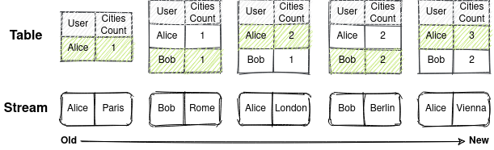
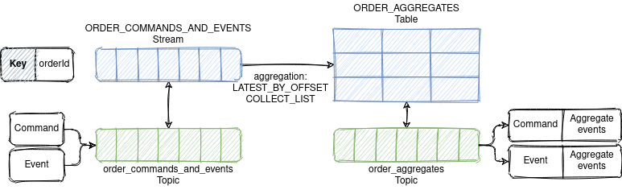
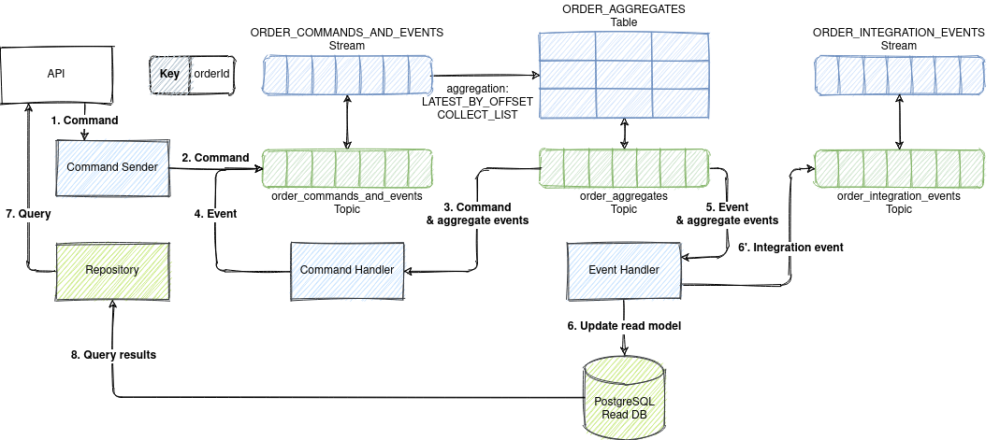

# Event Sourcing with Kafka and ksqlDB

* [Example Domain](#8753dff3c2879207fa06ef1844b1ea4d)
* [Event Sourcing and CQRS](#06ad43017847f2d88caea2e87018cd72)
* [Requirements for Event Store](#70b356f41293ace9df0d04cd8175ac35)
* [Solution Architecture](#9f6302143996033ebb94d536b860acc3)
    * [Kafka Topic Architecture](#7a5c6b7581644459b2452045e4b3584d)
    * [ksqlDB Streams vs Tables](#942a78423f55c5226a507463acf7be49)
    * [ksqlDb Event Store](#41e46dfc4197bfe5135c9953cd4eb8b7)
        * [Naive Solution (Not Working!)](#b55137335b62df2ead97b0ae0f1d7722)
        * [Working Solution](#c60b741f731650358e295c4598f5b9fd)
            * [Permanent Storage](#205928bf89c3012be2e11d1e5e7ad01f)
            * [Optimistic concurrency control](#6eec4db0e612f3a70dab7d96c463e8f6)
            * [Loading current state](#323effe18de24bcc666f161931c903f3)
            * [Subscribe to all events by aggregate type](#784ff5dca3b046266edf61637822bbff)
            * [Checkpoints](#0b584912c4fa746206884e080303ed49)
* [Why ksqlDB?](#56a081f86b7ec6a7d523c7e6d186f1a3)
* [How to Run the Sample?](#53af957fc9dc9f7083531a00fe3f364e)

## <a name="8753dff3c2879207fa06ef1844b1ea4d"></a>Example Domain

The example domain is ride hailing.

* A rider can place an order for a ride along a route specifying a price.
* A driver can accept and complete an order.
* An order can be cancelled before completion.

## <a name="06ad43017847f2d88caea2e87018cd72"></a>Event Sourcing and CQRS

TBD

A command generates zero or more events or results in an error.

## <a name="70b356f41293ace9df0d04cd8175ac35"></a>Requirements for Event Store

* Permanent storage. Store events forever.
* Optimistic concurrency control. Prevent lost update anomaly (write-write conflicts).
* Loading current state. Loading all previous events for the particular aggregate ID from an event
  store.
* Subscribe to all events by aggregate type. Instead of subscribing to a single event stream that
  represents an aggregate.
* Checkpoints. Store the event offset (a position in the stream) after handling it. Subscribe from
  the last known position instead of the stream start after the application restart.

## <a name="9f6302143996033ebb94d536b860acc3"></a>Solution Architecture

### <a name="7a5c6b7581644459b2452045e4b3584d"></a>Kafka Topic Architecture


* Topics are partitioned, meaning a topic is spread over a number of "buckets".
* Kafka preserves the order of messages within a partition. If messages were sent from the producer
  in a specific order, the broker will write them to a partition in that order and all consumers
  will read them in that order.
* Keys are used to decide to which partition message will go. All messages with the same key will go
  to the same partition.
* In one consumer group, each partition will be processed by one consumer only.
* Consumer commits an offset of a message after processing it. Thus, consumer will continue
  consuming messages from where it left off in the offset after a restart.

### <a name="942a78423f55c5226a507463acf7be49"></a>ksqlDB Streams vs Tables




### <a name="41e46dfc4197bfe5135c9953cd4eb8b7"></a>ksqlDb Event Store

#### <a name="b55137335b62df2ead97b0ae0f1d7722"></a>Naive Solution (Not Working!)

1. Commands are not persisted.
2. `ORDER_EVENTS` stream for storing events with `ORDER_ID` as a key.
3. `ORDER_AGGREGATES` table aggregates events by `ORDER_ID` (a key).
4. Command handler reads by ID aggregate events from `ORDER_AGGREGATES` table and appends new events
   to `ORDER_EVENTS` stream.

```sql
CREATE STREAM ORDER_EVENTS (
  ORDER_ID STRING KEY,
  TYPE STRING,
  DETAILS STRING
) WITH (
  KAFKA_TOPIC='order-events',
  PARTITIONS=10,
  VALUE_FORMAT='JSON'
);
```

```sql
CREATE TABLE ORDER_AGGREGATES WITH (
  KAFKA_TOPIC='order-aggregates',
  PARTITIONS=10,
  VALUE_FORMAT='JSON'
) AS SELECT
  ORDER_ID,
  COLLECT_LIST(TYPE) AS TYPE_LIST,
  COLLECT_LIST(DETAILS) AS DETAILS_LIST
FROM ORDER_COMMANDS_AND_EVENTS
GROUP BY ORDER_ID
EMIT CHANGES;
```

ksqlDB persistent query that does the stream aggregation into a table runs as a background process.

**There is no guarantee that the command handler will read the latest version of the aggregate.**


#### <a name="c60b741f731650358e295c4598f5b9fd"></a>Working Solution

1. Commands and events are persistent in the same stream `ORDER_COMMANDS_AND_EVENTS` with `ORDER_ID`
   as a key to preserve ordering.
2. `ORDER_AGGREGATES` table aggregates events (`LATEST_BY_OFFSET` and `COLLECT_LIST`)
   by `ORDER_ID` (a key).
3. Command handler consumes commands from `order-aggregates` topic where changes
   in `ORDER_AGGREGATES` are published. Thus, processing command B that immediately follows command
   A, it will be possible to read all previous events generated by command A.
4. Event handler consumes events form `order-aggregates` topic too.

```sql
CREATE STREAM ORDER_COMMANDS_AND_EVENTS (
  ORDER_ID STRING KEY,
  TYPE STRING,
  SUB_TYPE STRING,
  DETAILS STRING
) WITH (
  KAFKA_TOPIC='order-commands-and-events',
  PARTITIONS=10,
  VALUE_FORMAT='JSON'
);
```

```sql
CREATE TABLE ORDER_AGGREGATES WITH (
  KAFKA_TOPIC='order-aggregates',
  PARTITIONS=10,
  VALUE_FORMAT='JSON'
) AS SELECT
  ORDER_ID,
  LATEST_BY_OFFSET(TYPE) as LATEST_TYPE,
  LATEST_BY_OFFSET(SUB_TYPE) as LATEST_SUB_TYPE,
  LATEST_BY_OFFSET(DETAILS) as LATEST_DETAILS,
  COLLECT_LIST(TYPE) AS TYPE_LIST,
  COLLECT_LIST(SUB_TYPE) AS SUB_TYPE_LIST,
  COLLECT_LIST(DETAILS) AS DETAILS_LIST
FROM ORDER_COMMANDS_AND_EVENTS
GROUP BY ORDER_ID
EMIT CHANGES;
```



All parts together look like this



##### <a name="205928bf89c3012be2e11d1e5e7ad01f"></a>Permanent Storage

Events can be stored in Kafka topics permanently.

To set retention to "forever" set properties in `kafka.properties`

```properties
log.retention.ms=-1
log.retention.bytes=-1
```

or environment variables for `confluentinc/cp-kafka` image

```yaml
KAFKA_LOG_RETENTION_MS: -1
KAFKA_LOG_RETENTION_BYTES: -1
```

For storing huge volumes of data in Kafka
use [Tired Storage](https://www.confluent.io/blog/infinite-kafka-storage-in-confluent-platform/).

##### <a name="6eec4db0e612f3a70dab7d96c463e8f6"></a>Optimistic concurrency control

* Messages with the same key goes to the same partition.
* Kafka preserves the order of messages within a partition.
* Each partition is processed by one consumer only.

Thus, commands and events for the same aggregate are processed sequentially. It allows implementing
optimistic concurrency control base on version check.

```java
if(order.getBaseVersion()!=command.getOriginalVersion()){
    //Order base version does not match command expected version
    }
```

It is possible that the broker will fail to write the first batch of messages, succeed to write the
second, and then retry the first batch and succeed, thereby reversing the order.

Set `max.in.flight.requests.per.connection=1` to make sure that while a batch of messages is
retrying, additional messages will not be sent.

##### <a name="323effe18de24bcc666f161931c903f3"></a>Loading current state

`ORDER_AGGREGATES` table records and messages in its changelog topic `order-aggregates` contain all
aggregate events (`COLLECT_LIST(DETAILS)`) next to the last event (`LATEST_BY_OFFSET(DETAILS)`).

All aggregate events can be fetched using a ksqlDB pull query also

```sql
SELECT * FROM ORDER_AGGREGATES WHERE ORDER_ID = :orderId;
```

##### <a name="784ff5dca3b046266edf61637822bbff"></a>Subscribe to all events by aggregate type

`ORDER_AGGREGATES` table and in its changelog topic `order-aggregates` contain all aggregates of the
same type.

Consumers of `order-aggregates` topic receive all commands and events relates to the same aggregate
type.

##### <a name="0b584912c4fa746206884e080303ed49"></a>Checkpoints

Consumer commits offset of the last message after processing it. Consumer will continue consuming
messages from where it left off in the offset after a restart.

## <a name="56a081f86b7ec6a7d523c7e6d186f1a3"></a>Why ksqlDB?

Kafka is not for event sourcing, isn't it?

Kafka alone is not an event store, but Kafka and ksqlDB together allow building full-featured event
stores.

It is also possible to build event sourced systems with Kafka Streams. I find ksqlDB simpler and
more convenient solution for event sourcing because Kafka Streams has a few limitations:

* Kafka Streams is a library for JVM (Java, Scala etc.) and not a server.
* Kafka Streams DSL has steep learning curve compared to the SQL dialect of ksqlDB.
* The full state of an application is split across many distributed instances of the application.
  Kafka Streams allows an application to query its local state stores for the locally managed
  portion of the state. To query the full state, you must connect the various fragments of the state
  with and RPC
  ```java
  org.apache.kafka.streams.state.HostInfo hostInfo = 
    interactiveQueryService.getHostInfo("store-name", key, keySerializer);
  if (interactiveQueryService.getCurrentHostInfo().equals(hostInfo)) {
    //query from the store that is locally available
  } else {
    //query from the remote host
    RestTemplate restTemplate = new RestTemplate(); 
    return restTemplate.postForObject(String.format("http://%s:%d/%s", hostInfo.host(), hostInfo.port(), "endpoint"), ...);
  }
  ```

ksqlDB is actually uses Kafka Streams internally to provide higher level of abstraction. Thus,
ksqlDB has the following advantages:

* ksqlDB is a standalone server.
* Can be run in a cluster.
* Has HTTP/2 API and thus can be used with any programming language.
* Supports SQL dialect for queries.

## <a name="53af957fc9dc9f7083531a00fe3f364e"></a>How to Run the Sample?

1. Download & installOpenJDK 11 (LTS) at [AdoptOpenJDK](https://adoptopenjdk.net/).

2. Download and install [Docker](https://docs.docker.com/engine/install/)
   and [Docker Compose](https://docs.docker.com/compose/install/).

3. Build Java project and Docker image
    ```bash
    ./gradlew clean build jibDockerBuild -i
    ```

4. Run Kafka, ksqlDB and event-sourcing-app
    ```bash
    docker-compose up -d
    # wait a few minutes
    ```
5. Follow the logs of the application
    ```bash
    docker-compose logs -f event-sourcing-app
    ```
6. Install [curl](https://curl.se/) and [jq](https://stedolan.github.io/jq/).

7. Run [`test.sh`](test.sh) script and see the output.

8. Check that integration events were sent
   ```bash
   docker exec -it ksqldb-cli ksql http://ksqldb-server:8088
   #ksql>
   PRINT 'order-integration-events' FROM BEGINNING;
   ```

The `test.sh` script does the following:

1. Places new order
    ```bash
    ORDER_ID=$(curl -s -X POST http://localhost:8080/orders/ -d '{"riderId":"63770803-38f4-4594-aec2-4c74918f7165","price":"123.45","route":[{"address":"Київ, вулиця Полярна, 17А","lat":50.51980052414157,"lng":30.467197278948536},{"address":"Київ, вулиця Новокостянтинівська, 18В","lat":50.48509161169076,"lon":30.485170724431292}]}' -H 'Content-Type: application/json' | jq -r .orderId)
    sleep 1s
    ```
2. Gets the placed order
    ```bash
    curl -s -X GET http://localhost:8080/orders/$ORDER_ID | jq
    ```
    ```json
    {
      "id": "309aef67-c152-41c1-97a7-aeef839804b5",
      "version": 1,
      "status": "PLACED",
      "riderId": "63770803-38f4-4594-aec2-4c74918f7165",
      "price": 123.45,
      "route": [
        {
          "address": "Київ, вулиця Полярна, 17А",
          "lat": 50.51980052414157,
          "lon": 0
        },
        {
          "address": "Київ, вулиця Новокостянтинівська, 18В",
          "lat": 50.48509161169076,
          "lon": 30.485170724431292
        }
      ],
      "placedDate": "2021-04-19T08:58:19.818153Z"
    }
    ```
3. Accepts the order
    ```bash
    curl -s -X PATCH http://localhost:8080/orders/$ORDER_ID -d '{"status":"ACCEPTED","driverId":"2c068a1a-9263-433f-a70b-067d51b98378","version":1}' -H 'Content-Type: application/json'
    sleep 1s
    ```
4. Gets the accepted order
    ```bash
    curl -s -X GET http://localhost:8080/orders/$ORDER_ID | jq
    ```
    ```json
    {
      "id": "309aef67-c152-41c1-97a7-aeef839804b5",
      "version": 2,
      "status": "ACCEPTED",
      "riderId": "63770803-38f4-4594-aec2-4c74918f7165",
      "price": 123.45,
      "route": [
        {
          "address": "Київ, вулиця Полярна, 17А",
          "lat": 50.51980052414157,
          "lon": 0
        },
        {
          "address": "Київ, вулиця Новокостянтинівська, 18В",
          "lat": 50.48509161169076,
          "lon": 30.485170724431292
        }
      ],
      "driverId": "2c068a1a-9263-433f-a70b-067d51b98378",
      "placedDate": "2021-04-19T08:58:19.818153Z",
      "acceptedDate": "2021-04-19T08:58:20.895710Z"
    }
    ```
5. Completes the order
    ```bash
    curl -s -X PATCH http://localhost:8080/orders/$ORDER_ID -d '{"status":"COMPLETED","version":2}' -H 'Content-Type: application/json'
    sleep 1s
    ```
6. Gets the completed order
    ```bash
    curl -s -X GET http://localhost:8080/orders/$ORDER_ID | jq
    ```
    ```json
    {
      "id": "309aef67-c152-41c1-97a7-aeef839804b5",
      "version": 3,
      "status": "COMPLETED",
      "riderId": "63770803-38f4-4594-aec2-4c74918f7165",
      "price": 123.45,
      "route": [
        {
          "address": "Київ, вулиця Полярна, 17А",
          "lat": 50.51980052414157,
          "lon": 0
        },
        {
          "address": "Київ, вулиця Новокостянтинівська, 18В",
          "lat": 50.48509161169076,
          "lon": 30.485170724431292
        }
      ],
      "driverId": "2c068a1a-9263-433f-a70b-067d51b98378",
      "placedDate": "2021-04-19T08:58:19.818153Z",
      "acceptedDate": "2021-04-19T08:58:20.895710Z",
      "completedDate": "2021-04-19T08:58:21.952476Z"
    }
    ```
7. Tries to cancel the completed order
    ```bash
    curl -s -X PATCH http://localhost:8080/orders/$ORDER_ID -d '{"status":"CANCELLED","version":3}' -H 'Content-Type: application/json'
    sleep 1s
    ```
8. Gets the completed order with the error indicating that completed order can't be cancelled
    ```bash
    curl -s -X GET http://localhost:8080/orders/$ORDER_ID | jq
    ```
    ```json
    {
      "id": "309aef67-c152-41c1-97a7-aeef839804b5",
      "version": 4,
      "status": "COMPLETED",
      "riderId": "63770803-38f4-4594-aec2-4c74918f7165",
      "price": 123.45,
      "route": [
        {
          "address": "Київ, вулиця Полярна, 17А",
          "lat": 50.51980052414157,
          "lon": 0
        },
        {
          "address": "Київ, вулиця Новокостянтинівська, 18В",
          "lat": 50.48509161169076,
          "lon": 30.485170724431292
        }
      ],
      "driverId": "2c068a1a-9263-433f-a70b-067d51b98378",
      "placedDate": "2021-04-19T08:58:19.818153Z",
      "acceptedDate": "2021-04-19T08:58:20.895710Z",
      "completedDate": "2021-04-19T08:58:21.952476Z"
    }
    ```
9. Gets all events for the order
    ```bash
    curl -s -X GET http://localhost:8080/orders/$ORDER_ID/events | jq
    ```
    ```json
    [
      {
        "aggregateId": "309aef67-c152-41c1-97a7-aeef839804b5",
        "version": 1,
        "riderId": "63770803-38f4-4594-aec2-4c74918f7165",
        "price": 123.45,
        "route": [
          {
            "address": "Київ, вулиця Полярна, 17А",
            "lat": 50.51980052414157,
            "lon": 0
          },
          {
            "address": "Київ, вулиця Новокостянтинівська, 18В",
            "lat": 50.48509161169076,
            "lon": 30.485170724431292
          }
        ],
        "createdDate": "2021-04-19T08:58:19.818153Z",
        "eventType": "OrderPlacedEvent"
      },
      {
        "aggregateId": "309aef67-c152-41c1-97a7-aeef839804b5",
        "version": 2,
        "driverId": "2c068a1a-9263-433f-a70b-067d51b98378",
        "createdDate": "2021-04-19T08:58:20.895710Z",
        "eventType": "OrderAcceptedEvent"
      },
      {
        "aggregateId": "309aef67-c152-41c1-97a7-aeef839804b5",
        "version": 3,
        "createdDate": "2021-04-19T08:58:21.952476Z",
        "eventType": "OrderCompletedEvent"
      },
      {
        "aggregateId": "309aef67-c152-41c1-97a7-aeef839804b5",
        "version": 4,
        "errorMessage": "Order 309aef67-c152-41c1-97a7-aeef839804b5 in status COMPLETED can't be cancelled",
        "createdDate": "2021-04-19T08:58:23.024546Z",
        "eventType": "ErrorEvent"
      }
    ]
    ```

