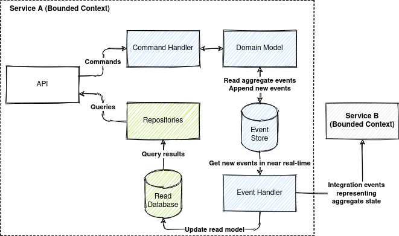

# Event Sourcing with Kafka and ksqlDB

* [Introduction](#0b79795d3efc95b9976c7c5b933afce2)
* [Example Domain](#8753dff3c2879207fa06ef1844b1ea4d)
* [Event Sourcing and CQRS 101](#19025f75ca30ec4a46f55a6b9afdeba6)
    * [State-Oriented Persistence](#436b314e78fec59a76bad8b93b52ee75)
    * [Event Sourcing](#c4b3d1c8edab1825366ac1d541d8226f)
    * [CQRS](#b2cf9293622451d86574d2973398ca70)
    * [Advantages of Event Sourcing and CQRS](#d8818c2c5ba0364540a49273f684b85c)
* [Requirements for Event Store](#70b356f41293ace9df0d04cd8175ac35)
* [Solution Architecture](#9f6302143996033ebb94d536b860acc3)
    * [Kafka Topic Architecture](#7a5c6b7581644459b2452045e4b3584d)
    * [ksqlDB Streams vs Tables](#942a78423f55c5226a507463acf7be49)
    * [ksqlDb Event Store](#41e46dfc4197bfe5135c9953cd4eb8b7)
        * [Naive Solution (Not Working!)](#b55137335b62df2ead97b0ae0f1d7722)
        * [Working Solution](#c60b741f731650358e295c4598f5b9fd)
            * [Permanent Storage](#205928bf89c3012be2e11d1e5e7ad01f)
            * [Optimistic concurrency control](#6eec4db0e612f3a70dab7d96c463e8f6)
            * [Loading current state](#323effe18de24bcc666f161931c903f3)
            * [Subscribe to all events by aggregate type](#784ff5dca3b046266edf61637822bbff)
            * [Checkpoints](#0b584912c4fa746206884e080303ed49)
            * [Drawbacks](#0cfc0523189294ac086e11c8e286ba2d)
* [Why ksqlDB?](#56a081f86b7ec6a7d523c7e6d186f1a3)
* [How to Run the Sample?](#53af957fc9dc9f7083531a00fe3f364e)

## <a name="0b79795d3efc95b9976c7c5b933afce2"></a>Introduction

Kafka is not for event sourcing, isn't it?

Kafka alone is not an event store, but Kafka and ksqlDB together allow building full-featured event
stores.

This repository provides a sample of event sourced system that uses Kafka and ksqlDB as event store.


See also

* [Event Sourcing with PostgreSQL](https://github.com/evgeniy-khist/postgresql-event-sourcing)
* [Event Sourcing with EventStoreDB](https://github.com/evgeniy-khist/eventstoredb-event-sourcing)

## <a name="8753dff3c2879207fa06ef1844b1ea4d"></a>Example Domain

The example domain is ride hailing.

* A rider can place an order for a ride along a route specifying a price.
* A driver can accept and complete an order.
* An order can be cancelled before completion.

## <a name="19025f75ca30ec4a46f55a6b9afdeba6"></a>Event Sourcing and CQRS 101

### <a name="436b314e78fec59a76bad8b93b52ee75"></a>State-Oriented Persistence


### <a name="c4b3d1c8edab1825366ac1d541d8226f"></a>Event Sourcing

Event sourcing persists the state of an entity as a sequence of immutable state-changing events.


Whenever the state of an entity changes, a new event is appended to the list of events.


Current state of an entity can be restored by replaying all its events.

An entity in event sourcing is also referenced as an aggregate.

### <a name="b2cf9293622451d86574d2973398ca70"></a>CQRS

CQRS (Command-query responsibility segregation) stands for segregating the responsibility between
commands (write requests) and queries (read requests). The write requests and the read requests are
processed by different handlers.

A command generates zero or more events or results in an error.


Event sourcing is usually used in conjunction with CQRS.



Events in event sourcing are a part of a bounded context and should not be used "as-is" for
integration with other bounded contexts. Integration events representing the current state of an
aggregate should be used for communication between bounded contexts instead of a raw event sourcing
change events.

### <a name="d8818c2c5ba0364540a49273f684b85c"></a>Advantages of Event Sourcing and CQRS

* Having a true history of the system (audit and traceability).
* Ability to put the system in any prior state (e.g. for debugging).
* Read-side projections can be created as needed (later) from events. It allows responding to future
  needs and new requirements.
* Independent scaling. CQRS allows We can scale the read and write databases independently of each
  other.
* Optimized data schema for read database (e.g. the read databases can be denormalized).
* Simpler queries (e.g. complex `JOIN` operations can be avoided).

## <a name="70b356f41293ace9df0d04cd8175ac35"></a>Requirements for Event Store

* Permanent storage. Store events forever.
* Optimistic concurrency control. Prevent lost update anomaly (write-write conflicts).
* Loading current state. Loading all previous events for the particular aggregate ID from an event
  store.
* Subscribe to all events by aggregate type. Instead of subscribing to a single event stream that
  represents an aggregate.
* Checkpoints. Store the event offset (a position in the stream) after handling it. Subscribe from
  the last known position instead of the stream start after the application restart.

## <a name="9f6302143996033ebb94d536b860acc3"></a>Solution Architecture

### <a name="7a5c6b7581644459b2452045e4b3584d"></a>Kafka Topic Architecture


* Topics are partitioned, meaning a topic is spread over a number of "buckets".
* Kafka preserves the order of messages within a partition. If messages were sent from the producer
  in a specific order, the broker will write them to a partition in that order and all consumers
  will read them in that order.
* Keys are used to decide to which partition message will go. All messages with the same key will go
  to the same partition.
* In one consumer group, each partition will be processed by one consumer only.
* Consumer commits an offset of a message after processing it. Thus, consumer will continue
  consuming messages from where it left off in the offset after a restart.

### <a name="942a78423f55c5226a507463acf7be49"></a>ksqlDB Streams vs Tables

A stream is a partitioned, immutable, append-only collection that represents a series of historical
facts.

A table is a mutable, partitioned collection that models change over time and represents what is
true as of "now".


Both steams and tables are backed by a Kafka topic.

The current state of a table is stored locally and ephemerally on a specific server by
using [RocksDB](https://rocksdb.org/). The series of changes that are applied to a table is stored
durably in a Kafka topic.


### <a name="41e46dfc4197bfe5135c9953cd4eb8b7"></a>ksqlDb Event Store

#### <a name="b55137335b62df2ead97b0ae0f1d7722"></a>Naive Solution (Not Working!)

1. Commands are not persisted.
2. `ORDER_EVENTS` stream for storing events with `AGGREGATE_ID` as a key.
3. `ORDER_AGGREGATES` table aggregates events by `AGGREGATE_ID` (a key).
4. Command handler reads by ID aggregate events from `ORDER_AGGREGATES` table and appends new events
   to `ORDER_EVENTS` stream.

```sql
CREATE STREAM ORDER_EVENTS (
  AGGREGATE_ID STRING KEY,
  TYPE STRING,
  JSON_DATA STRING
) WITH (
  KAFKA_TOPIC='order-events',
  PARTITIONS=10,
  REPLICAS=1,
  VALUE_FORMAT='JSON'
);

CREATE TABLE ORDER_AGGREGATES WITH (
  KAFKA_TOPIC='order-aggregates',
  PARTITIONS=10,
  REPLICAS=1,
  VALUE_FORMAT='JSON'
) AS SELECT
  AGGREGATE_ID,
  COLLECT_LIST(TYPE) AS TYPE_LIST,
  COLLECT_LIST(JSON_DATA) AS JSON_DATA_LIST
FROM ORDER_COMMANDS_AND_EVENTS
GROUP BY AGGREGATE_ID
EMIT CHANGES;
```

ksqlDB persistent query that does the stream aggregation into a table runs as a background process.

**There is no guarantee that the command handler will read the latest version of the aggregate.**


#### <a name="c60b741f731650358e295c4598f5b9fd"></a>Working Solution


1. Commands and events are persistent in the same stream `ORDER_COMMANDS_AND_EVENTS`
   with `AGGREGATE_ID`
   as a key to preserve ordering.
2. `ORDER_AGGREGATES` table aggregates commands and events (`COLLECT_LIST`) by `AGGREGATE_ID` (a
   key).
3. Command handler consumes commands from `order-aggregates` topic where changes
   in `ORDER_AGGREGATES` are published. Thus, processing command B that follows command A, it will
   be possible to read all previous events generated by command A.
4. Event handler consumes events form `order-aggregates` topic, updates the read database and sends
   integration events.

```sql
CREATE STREAM IF NOT EXISTS ORDER_COMMANDS_AND_EVENTS (
  AGGREGATE_ID STRING KEY,
  IS_COMMAND BOOLEAN,
  TYPE STRING,
  JSON_DATA STRING
) WITH (
  KAFKA_TOPIC='order-commands-and-events',
  PARTITIONS=10,
  REPLICAS=1,
  VALUE_FORMAT='JSON'
);

CREATE TABLE IF NOT EXISTS ORDER_AGGREGATES WITH (
  KAFKA_TOPIC='order-aggregates',
  PARTITIONS=10,
  REPLICAS=1,
  VALUE_FORMAT='JSON'
) AS SELECT
  AGGREGATE_ID,
  COLLECT_LIST(IS_COMMAND) AS IS_COMMAND_LIST,
  COLLECT_LIST(TYPE) AS TYPE_LIST,
  COLLECT_LIST(JSON_DATA) AS JSON_DATA_LIST
FROM ORDER_COMMANDS_AND_EVENTS
GROUP BY AGGREGATE_ID
EMIT CHANGES;
```

All parts together look like this


##### <a name="205928bf89c3012be2e11d1e5e7ad01f"></a>Permanent Storage

Events can be stored in Kafka topics permanently.

To set retention to "forever" set properties in `kafka.properties`

```properties
log.retention.ms=-1
log.retention.bytes=-1
```

or environment variables for `confluentinc/cp-kafka` image

```yaml
KAFKA_LOG_RETENTION_MS: -1
KAFKA_LOG_RETENTION_BYTES: -1
```

For storing huge volumes of data in Kafka
use [Tired Storage](https://www.confluent.io/blog/infinite-kafka-storage-in-confluent-platform/).

##### <a name="6eec4db0e612f3a70dab7d96c463e8f6"></a>Optimistic concurrency control

**Command must generate one or more events** in order to implement optimistic concurrency control.

Commands and events for the same aggregate are processed sequentially because:

* Messages with the same key goes to the same partition.
* Kafka preserves the order of messages within a partition.
* Each partition is processed by one consumer only.

Thus, optimistic concurrency control based on version check can be implemented:

1. Actual aggregate version must match the expected version specified in a command.
2. The last entry from the stream must be a command, and the last but one must be an event. If both
   entries (the last and the last but one) are commands, it's a concurrent modification.

```java
class OrderCommandHandler {

  // ...
  private boolean checkVersionMatches(
      Command latestCommand, List<Command> unprocessedCommands, Order order) {
    if (order.getBaseVersion() != latestCommand.getExpectedVersion()) {
      // Actual version doesn't match expected version
      return false;
    }
    if (unprocessedCommands.size() > 1) {
      // Concurrent modification
      return false;
    }
    return true;
  }
}
```

Also, set a Kafka producer property `max.in.flight.requests.per.connection=1` to make sure that
while a batch of messages is retrying, additional messages will not be sent.

It is possible that the broker will fail to write the first batch of messages, succeed to write the
second, and then retry the first batch and succeed, thereby reversing the order.

##### <a name="323effe18de24bcc666f161931c903f3"></a>Loading current state

**There is no need to do a remote call to fetch all events for an aggregate.**

`ORDER_AGGREGATES` table records and messages in its changelog topic `order-aggregates` contain all
aggregate events and commands (`COLLECT_LIST(JSON_DATA)`).

When a command, or an event is consumed from `order-aggregates` topic, the message already contains
all aggregate events.

However, it is also possible to fetch all events for an aggregate with ksqlDB SQL query

```sql
SELECT * FROM ORDER_AGGREGATES WHERE AGGREGATE_ID='${orderId}' AND IS_COMMAND=false;
```

##### <a name="784ff5dca3b046266edf61637822bbff"></a>Subscribe to all events by aggregate type

`ORDER_AGGREGATES` table and in its changelog topic `order-aggregates` contain all aggregates of the
same type.

Consumers of `order-aggregates` topic receive all commands and events related to the same aggregate
type.

##### <a name="0b584912c4fa746206884e080303ed49"></a>Checkpoints

Consumer commits offset of the last message after processing it. Consumer will continue consuming
messages from where it left off in the offset after a restart.

##### <a name="0cfc0523189294ac086e11c8e286ba2d"></a>Drawbacks

1. Commands have to be persisted. It's easy to flood the system with invalid commands that will take
   a lot of space in the storage.
2. Commands are processed asynchronously, so after submitting a command a result of processing can't
   be received synchronously. API should be designed with asynchrony in mind.
3. Errors have to be modelled as events due to asynchronous command processing. A command resulting
   in error produces the `ErrorEvent` and increments the aggregate version.
4. A command must generate one or more events (and never zero events). Otherwise, optimistic
   concurrency check implementation will work incorrectly.
5. Adding event sourcing snapshotting is possible but will complicate the solution even more.
   Snapshotting is an optimization technique where a snapshot of the aggregate's state is also
   saved, so an application can restore the current state of an aggregate from the snapshot instead
   of from scratch.

## <a name="56a081f86b7ec6a7d523c7e6d186f1a3"></a>Why ksqlDB?

It is possible to build event sourced systems with Kafka Streams, but I find ksqlDB simpler and more
convenient solution for event sourcing because Kafka Streams has a few limitations:

* Kafka Streams is a library for JVM (Java, Scala etc.) and not a server.
* Kafka Streams DSL has steep learning curve compared to the SQL dialect of ksqlDB.
* The full state of an application is split across many distributed instances of the application.
  Kafka Streams allows an application to query its local state stores for the locally managed
  portion of the state. To query the full state, you must connect the various fragments of the state
  with and RPC
  ```java
  org.apache.kafka.streams.state.HostInfo hostInfo = 
    interactiveQueryService.getHostInfo("store-name", key, keySerializer);
  if (interactiveQueryService.getCurrentHostInfo().equals(hostInfo)) {
    //query from the store that is locally available
  } else {
    //query from the remote host
    RestTemplate restTemplate = new RestTemplate(); 
    return restTemplate.postForObject(String.format("http://%s:%d/%s", hostInfo.host(), hostInfo.port(), "endpoint"), ...);
  }
  ```

ksqlDB is actually uses Kafka Streams internally to provide higher level of abstraction. Thus,
ksqlDB has the following advantages:

* ksqlDB is a standalone server.
* Can be run in a cluster.
* Supports SQL dialect for queries.
* Has CLI and HTTP/2 API. Thus, can be used with any programming language (HTTP API and CLI are
  disabled when ksqlDB is started in headless mode).

## <a name="53af957fc9dc9f7083531a00fe3f364e"></a>How to Run the Sample?

1. Download & installOpenJDK 11 (LTS) at [AdoptOpenJDK](https://adoptopenjdk.net/).

2. Download and install [Docker](https://docs.docker.com/engine/install/)
   and [Docker Compose](https://docs.docker.com/compose/install/).

3. Build Java project and Docker image
    ```bash
    ./gradlew clean build jibDockerBuild -i
    ```

4. Run Kafka, ksqlDB and event-sourcing-app
    ```bash
    docker-compose up -d --scale event-sourcing-app=2
    # wait a few minutes
    ```
5. Follow the logs of the application
    ```bash
    docker-compose logs -f event-sourcing-app
    ```
6. Install [curl](https://curl.se/) and [jq](https://stedolan.github.io/jq/).

7. Run [`test.sh`](test.sh) script and see the output.

The `test.sh` script has the following instructions:

1. Place new order.
    ```bash
    ORDER_ID=$(curl -s -X POST http://localhost:8080/orders/ -d '{"riderId":"63770803-38f4-4594-aec2-4c74918f7165","price":"123.45","route":[{"address":"Київ, вулиця Полярна, 17А","lat":50.51980052414157,"lon":30.467197278948536},{"address":"Київ, вулиця Новокостянтинівська, 18В","lat":50.48509161169076,"lon":30.485170724431292}]}' -H 'Content-Type: application/json' | jq -r .orderId)
    sleep 1s
    ```
2. Get the placed order.
    ```bash
    curl -s -X GET http://localhost:8080/orders/$ORDER_ID | jq
    ```
    ```json
    {
      "id": "827e3a63-d252-415f-af60-94c5a36bfcd6",
      "version": 1,
      "status": "PLACED",
      "riderId": "63770803-38f4-4594-aec2-4c74918f7165",
      "price": 123.45,
      "route": [
        {
          "address": "Київ, вулиця Полярна, 17А",
          "lat": 50.51980052414157,
          "lon": 30.467197278948536
        },
        {
          "address": "Київ, вулиця Новокостянтинівська, 18В",
          "lat": 50.48509161169076,
          "lon": 30.485170724431292
        }
      ],
      "placedDate": "2021-04-23T15:26:22.543938Z",
      "errors": []
    }
    ```
3. Accept the order. Try to cancel the order concurrently to simulate a write-write conflict.
    ```bash
    curl -s -X PATCH http://localhost:8080/orders/$ORDER_ID -d '{"status":"ACCEPTED","driverId":"2c068a1a-9263-433f-a70b-067d51b98378","version":1}' -H 'Content-Type: application/json'
    curl -s -X PATCH http://localhost:8080/orders/$ORDER_ID -d '{"status":"CANCELLED","version":1}' -H 'Content-Type: application/json'
    sleep 1s
    ```
4. Get the accepted order with optimistic concurrency control error.
    ```bash
    curl -s -X GET http://localhost:8080/orders/$ORDER_ID | jq
    ```
    ```json
    {
      "id": "827e3a63-d252-415f-af60-94c5a36bfcd6",
      "version": 2,
      "status": "ACCEPTED",
      "riderId": "63770803-38f4-4594-aec2-4c74918f7165",
      "price": 123.45,
      "route": [
        {
          "address": "Київ, вулиця Полярна, 17А",
          "lat": 50.51980052414157,
          "lon": 30.467197278948536
        },
        {
          "address": "Київ, вулиця Новокостянтинівська, 18В",
          "lat": 50.48509161169076,
          "lon": 30.485170724431292
        }
      ],
      "driverId": "2c068a1a-9263-433f-a70b-067d51b98378",
      "placedDate": "2021-04-23T15:26:22.543938Z",
      "acceptedDate": "2021-04-23T15:26:23.542921Z",
      "errors": [
        {
          "command": "CancelOrderCommand",
          "expectedVersion": 1,
          "message": "Concurrent modification"
        }
      ]
    }
    ```
5. Try to cancel an outdated version of the order to simulate lost update.
    ```bash
    curl -s -X PATCH http://localhost:8080/orders/$ORDER_ID -d '{"status":"CANCELLED","version":1}' -H 'Content-Type: application/json'
    sleep 1s
    ```
6. Get the accepted order with optimistic concurrency control error.
    ```bash
    curl -s -X GET http://localhost:8080/orders/$ORDER_ID | jq
    ```
    ```json
    {
      "id": "827e3a63-d252-415f-af60-94c5a36bfcd6",
      "version": 3,
      "status": "ACCEPTED",
      "riderId": "63770803-38f4-4594-aec2-4c74918f7165",
      "price": 123.45,
      "route": [
        {
          "address": "Київ, вулиця Полярна, 17А",
          "lat": 50.51980052414157,
          "lon": 30.467197278948536
        },
        {
          "address": "Київ, вулиця Новокостянтинівська, 18В",
          "lat": 50.48509161169076,
          "lon": 30.485170724431292
        }
      ],
      "driverId": "2c068a1a-9263-433f-a70b-067d51b98378",
      "placedDate": "2021-04-23T15:26:22.543938Z",
      "acceptedDate": "2021-04-23T15:26:23.542921Z",
      "errors": [
        {
          "command": "CancelOrderCommand",
          "expectedVersion": 1,
          "message": "Concurrent modification"
        },
        {
          "command": "CancelOrderCommand",
          "expectedVersion": 1,
          "message": "Actual version 2 doesn't match expected version 1"
        }
      ]
    }
    ```
7. Try to cancel a version of the order 'from the future' to simulate unordering.
    ```bash
    curl -s -X PATCH http://localhost:8080/orders/$ORDER_ID -d '{"status":"CANCELLED","version":4}' -H 'Content-Type: application/json'
    sleep 1s
    ```
8. Get the accepted order with optimistic concurrency control error.
    ```bash
    curl -s -X GET http://localhost:8080/orders/$ORDER_ID | jq
    ```
    ```json
    {
      "id": "827e3a63-d252-415f-af60-94c5a36bfcd6",
      "version": 4,
      "status": "ACCEPTED",
      "riderId": "63770803-38f4-4594-aec2-4c74918f7165",
      "price": 123.45,
      "route": [
        {
          "address": "Київ, вулиця Полярна, 17А",
          "lat": 50.51980052414157,
          "lon": 30.467197278948536
        },
        {
          "address": "Київ, вулиця Новокостянтинівська, 18В",
          "lat": 50.48509161169076,
          "lon": 30.485170724431292
        }
      ],
      "driverId": "2c068a1a-9263-433f-a70b-067d51b98378",
      "placedDate": "2021-04-23T15:26:22.543938Z",
      "acceptedDate": "2021-04-23T15:26:23.542921Z",
      "errors": [
        {
          "command": "CancelOrderCommand",
          "expectedVersion": 1,
          "message": "Concurrent modification"
        },
        {
          "command": "CancelOrderCommand",
          "expectedVersion": 1,
          "message": "Actual version 2 doesn't match expected version 1"
        },
        {
          "command": "CancelOrderCommand",
          "expectedVersion": 4,
          "message": "Actual version 3 doesn't match expected version 4"
        }
      ]
    }
    ```
9. Complete the order.
    ```bash
    curl -s -X PATCH http://localhost:8080/orders/$ORDER_ID -d '{"status":"COMPLETED","version":4}' -H 'Content-Type: application/json'
    sleep 1s
    ```
10. Get the completed order.
    ```bash
    curl -s -X GET http://localhost:8080/orders/$ORDER_ID | jq
    ```
    ```json
    {
      "id": "827e3a63-d252-415f-af60-94c5a36bfcd6",
      "version": 5,
      "status": "COMPLETED",
      "riderId": "63770803-38f4-4594-aec2-4c74918f7165",
      "price": 123.45,
      "route": [
        {
          "address": "Київ, вулиця Полярна, 17А",
          "lat": 50.51980052414157,
          "lon": 30.467197278948536
        },
        {
          "address": "Київ, вулиця Новокостянтинівська, 18В",
          "lat": 50.48509161169076,
          "lon": 30.485170724431292
        }
      ],
      "driverId": "2c068a1a-9263-433f-a70b-067d51b98378",
      "placedDate": "2021-04-23T15:26:22.543938Z",
      "acceptedDate": "2021-04-23T15:26:23.542921Z",
      "completedDate": "2021-04-23T15:26:26.791512Z",
      "errors": [
        {
          "command": "CancelOrderCommand",
          "expectedVersion": 1,
          "message": "Concurrent modification"
        },
        {
          "command": "CancelOrderCommand",
          "expectedVersion": 1,
          "message": "Actual version 2 doesn't match expected version 1"
        },
        {
          "command": "CancelOrderCommand",
          "expectedVersion": 4,
          "message": "Actual version 3 doesn't match expected version 4"
        }
      ]
    }
    ```
11. Try to cancel a completed order to simulate business rule violation.
    ```bash
    curl -s -X PATCH http://localhost:8080/orders/$ORDER_ID -d '{"status":"CANCELLED","version":5}' -H 'Content-Type: application/json'
    sleep 1s
    ```
12. Get the completed order with business rule validation error.
    ```bash
    curl -s -X GET http://localhost:8080/orders/$ORDER_ID | jq
    ```
    ```json
    {
      "id": "827e3a63-d252-415f-af60-94c5a36bfcd6",
      "version": 6,
      "status": "COMPLETED",
      "riderId": "63770803-38f4-4594-aec2-4c74918f7165",
      "price": 123.45,
      "route": [
        {
          "address": "Київ, вулиця Полярна, 17А",
          "lat": 50.51980052414157,
          "lon": 30.467197278948536
        },
        {
          "address": "Київ, вулиця Новокостянтинівська, 18В",
          "lat": 50.48509161169076,
          "lon": 30.485170724431292
        }
      ],
      "driverId": "2c068a1a-9263-433f-a70b-067d51b98378",
      "placedDate": "2021-04-23T15:26:22.543938Z",
      "acceptedDate": "2021-04-23T15:26:23.542921Z",
      "completedDate": "2021-04-23T15:26:26.791512Z",
      "errors": [
        {
          "command": "CancelOrderCommand",
          "expectedVersion": 1,
          "message": "Concurrent modification"
        },
        {
          "command": "CancelOrderCommand",
          "expectedVersion": 1,
          "message": "Actual version 2 doesn't match expected version 1"
        },
        {
          "command": "CancelOrderCommand",
          "expectedVersion": 4,
          "message": "Actual version 3 doesn't match expected version 4"
        },
        {
          "command": "CancelOrderCommand",
          "expectedVersion": 5,
          "message": "Order in status COMPLETED can't be cancelled"
        }
      ]
    }
    ```
13. Print integration events.
    ```bash
    docker exec -it kafka /bin/kafka-console-consumer --bootstrap-server localhost:9092 --topic order-integration-events --from-beginning --property print.key=true --timeout-ms 3000
    ```
    ```
    827e3a63-d252-415f-af60-94c5a36bfcd6	{"order_id":"827e3a63-d252-415f-af60-94c5a36bfcd6","event_type":"OrderPlacedEvent","event_timestamp":1619191582543,"version":1,"status":"PLACED","rider_id":"63770803-38f4-4594-aec2-4c74918f7165","price":123.45,"route":[{"ADDRESS":"Київ, вулиця Полярна, 17А","LAT":50.51980052414157,"LON":30.467197278948536},{"ADDRESS":"Київ, вулиця Новокостянтинівська, 18В","LAT":50.48509161169076,"LON":30.485170724431292}]}
    827e3a63-d252-415f-af60-94c5a36bfcd6	{"order_id":"827e3a63-d252-415f-af60-94c5a36bfcd6","event_type":"OrderAcceptedEvent","event_timestamp":1619191583542,"version":2,"status":"ACCEPTED","rider_id":"63770803-38f4-4594-aec2-4c74918f7165","price":123.45,"route":[{"ADDRESS":"Київ, вулиця Полярна, 17А","LAT":50.51980052414157,"LON":30.467197278948536},{"ADDRESS":"Київ, вулиця Новокостянтинівська, 18В","LAT":50.48509161169076,"LON":30.485170724431292}],"driver_id":"2c068a1a-9263-433f-a70b-067d51b98378"}
    827e3a63-d252-415f-af60-94c5a36bfcd6	{"order_id":"827e3a63-d252-415f-af60-94c5a36bfcd6","event_type":"OrderCompletedEvent","event_timestamp":1619191586791,"version":5,"status":"COMPLETED","rider_id":"63770803-38f4-4594-aec2-4c74918f7165","price":123.45,"route":[{"ADDRESS":"Київ, вулиця Полярна, 17А","LAT":50.51980052414157,"LON":30.467197278948536},{"ADDRESS":"Київ, вулиця Новокостянтинівська, 18В","LAT":50.48509161169076,"LON":30.485170724431292}],"driver_id":"2c068a1a-9263-433f-a70b-067d51b98378"}
    ```
